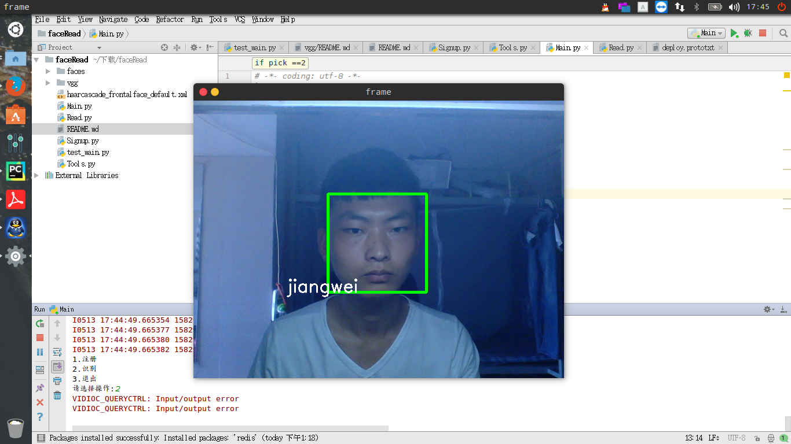
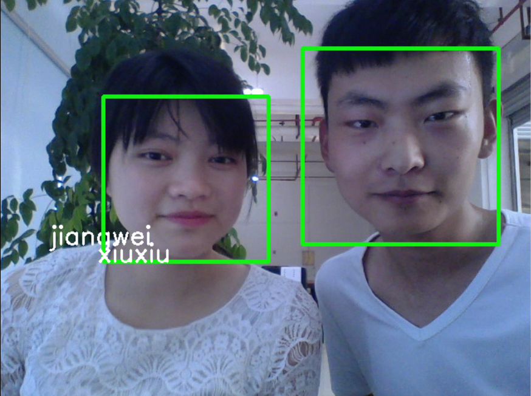
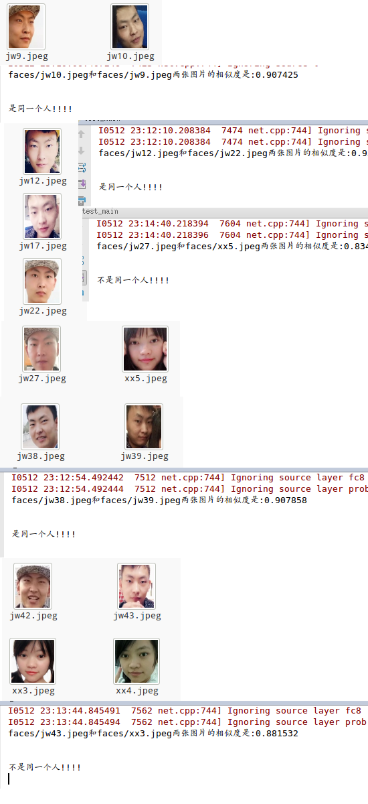

基于神经网络的人脸识别Rest API

需要环境：
opencv
caffe
django
.....

识别结果：
  
  
  

文件说明：
model 文件夹存放的是一些模型文件
RestServer是核心代码

项目将人脸识别与人脸定位的功能封装成了REST API，将RestServer运行起来以后就可以通过REST API的方式访问调用

运行方法：进入RestServer文件夹，打开main.py文件，修改成你本机的路径，然后在RestServer目录下运行python manage.py runserver 没有报错即可

API调用方法：

<table>
	<tr><td>接口地址</td> <td>方法</td> <td>参数</td> <td>说明</td>  <td>返回参数</td>  </tr>
	<tr>
	<td>http://你的ip/compared </td> <td> POST</td> <td>face1 和 face2 数据为你的两张人脸图片 </td>  <td>人脸对比接口地址</td>
	 <td > JSON数组，status调用是否成功，data为两张人脸的相似度（大约78%可判断为同一个人），msg为说明，runtime为识别执行时间
	</td>
	</tr>
	<tr>
	<td>http://你的ip/locate  </td> <td> POST</td> <td>pic 数据为你需要定位人脸的图片 </td>  <td>人脸定位接口地址</td>
	 <td > JSON数组，返回中每有一个数组就表示检测到一张人脸 X，Y表示人脸左上角坐标，height width表示高度和宽度
	</td>
	</tr>
	<tr>
		<td>http://你的ip/gender</td><td colspan="4">性别检测，功能待实现。。。</td>
	</tr>
		<tr>
		<td>http://你的ip/expression</td><td colspan="4">表情检测，功能待实现。。。</td>
	</tr>
	<tr>
		<td>http://你的ip/age</td><td colspan="4">年龄检测，功能待实现。。。</td>
	</tr>
</table>

部署说明：

如果你需要用于生产项目使用，该项目一定要用apache2或者ngnix发布，上面提供的运行方法仅供测试使用。具体部署访问请参考django项目部署

最后！！

欢迎提出意见，如果改进优化了这个项目请也提交我一份代码，邮箱地址 ok@xjiangwei.cn
